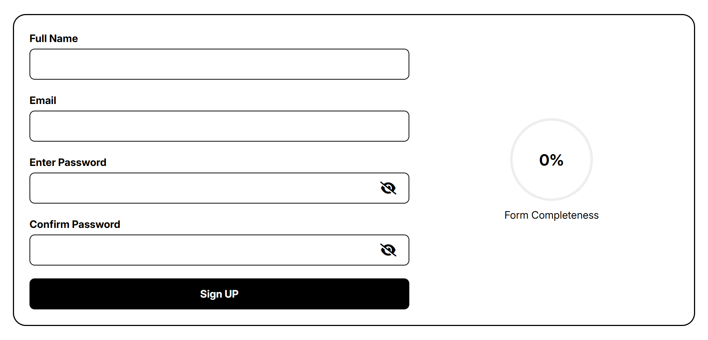
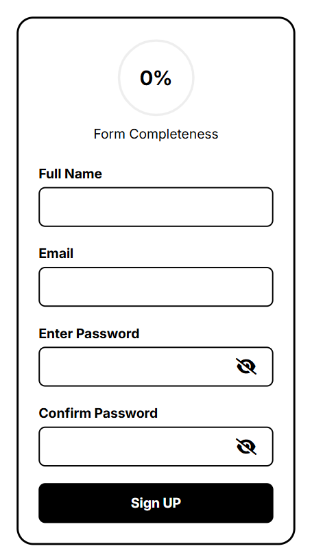

# Accessible Sign-Up Form

This is an accessible and responsive sign-up form that includes a real-time visual progress indicator. The project emphasizes accessibility best practices, modern styling with Tailwind CSS, and external JavaScript libraries integration.

## 🔍 Overview

The form guides users through the sign-up process with:

- **Real-time form validation**
- **Animated circular progress bar** showing completion status
- **Password visibility toggle**
- **Accessibility support** for screen readers and keyboard navigation

---

## 🚀 Features

- ✅ Accessible form inputs with `aria-describedby` and live validation messages
- ✅ Custom password confirmation logic using native HTML5 validation and JavaScript
- ✅ Dynamic progress circle powered by [ProgressBar.js](https://kimmobrunfeldt.github.io/progressbar.js/)
- ✅ Password visibility toggle using Font Awesome icons
- ✅ Responsive and clean UI with Tailwind CSS
- ✅ Fully keyboard-navigable and screen-reader friendly

---

## 🧰 Technologies Used

| Tool               | Description                                            |
| ------------------ | ------------------------------------------------------ |
| **HTML5**          | Semantic and accessible markup                         |
| **Tailwind CSS**   | Utility-first CSS framework for responsive design      |
| **JavaScript**     | Form validation, progress logic, interactivity         |
| **Font Awesome**   | Icons for password toggle                              |
| **ProgressBar.js** | External JS library for animated progress bar          |
| **NPM**            | Project dependency and script management (build tools) |

---

## 📚 What I Learned

During this project, I gained hands-on experience with:

- 📦 Using **NPM** to manage dependencies and build pipelines
- 🎨 Implementing custom styles with **Tailwind CSS**
- 📦 Importing and configuring **external JavaScript libraries** (like ProgressBar.js)
- ♿ Applying **accessibility best practices**:
  - ARIA attributes (`aria-label`, `aria-describedby`)
  - Keyboard focus support (`tabindex`, `role="button"`)
  - Live validation (`aria-live="assertive"`)

---

## 📷 Screenshot




---

## 🛠️ Installation & Setup

> ⚠️ Ensure you have Node.js and NPM installed.

```bash
# Install Tailwind and other dependencies
npm install


# build & watch for changes
npm run dev
```
